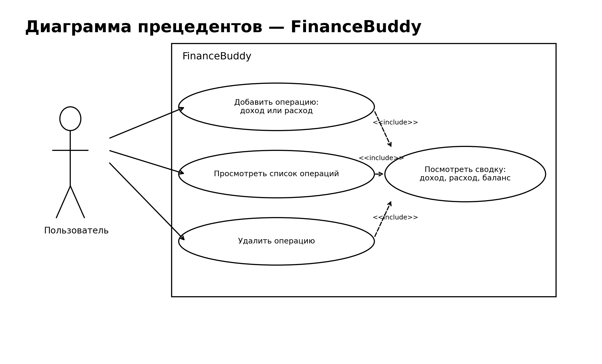

# Диаграмма прецедентов

## Диаграмма

## Смысл диаграммы
Я выделил четыре ключевых сценария:
- добавить операцию, доход или расход;
- просмотреть список операций;
- удалить операцию;
- посмотреть сводку по доходам, расходам и балансу.

Сводка пересчитывается при добавлении, удалении и просмотре данных.
