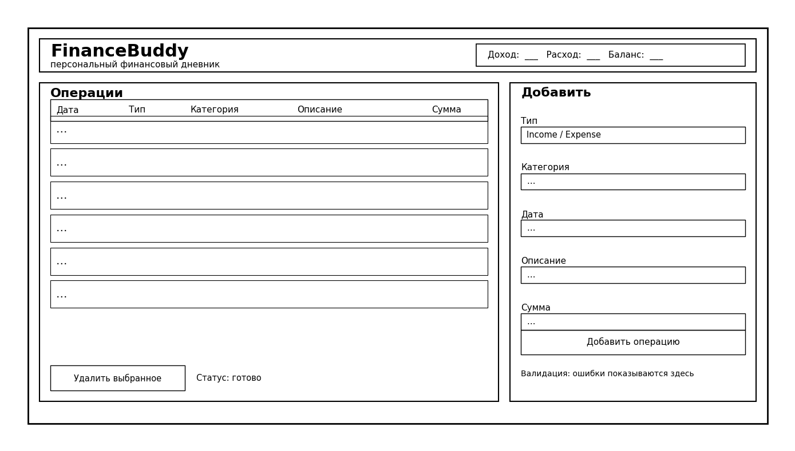

# Интерфейс приложения

## Макет главного окна

## Что реализовано в MVP
Я сделал один основной экран:
- слева таблица операций: дата, тип, категория, описание, сумма;
- снизу кнопка удаления выбранной операции и строка статуса;
- справа форма добавления: тип, категория, дата, описание, сумма;
- сверху сводка по доходам, расходам и балансу.

## Что добавлю дальше
- фильтры по дате и категории;
- отдельный экран управления категориями;
- экспорт и импорт данных.
