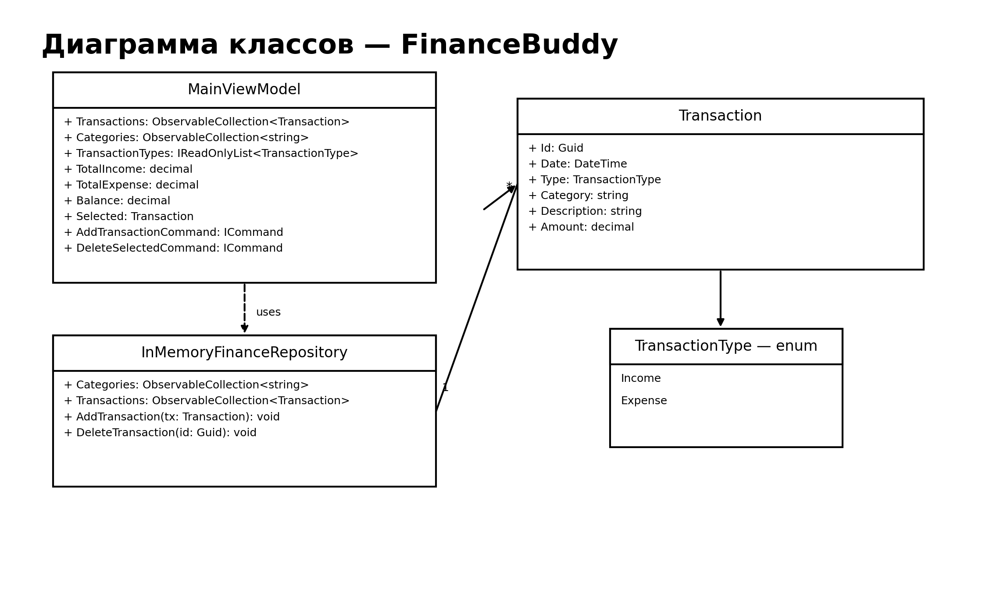

# Диаграмма классов

## Диаграмма

## Комментарий
На диаграмме показаны ключевые элементы приложения:
- `MainViewModel` — управляет состоянием главного окна и командами.
- `Transaction` — модель операции.
- `IFinanceRepository` — контракт слоя Data (категории + операции, CRUD).
- `EfFinanceRepository` — реализация репозитория на EF Core (SQLite).
- `FinanceBuddyDbContext` — контекст EF Core с таблицами `Categories` и `Transactions`.
- `IEditWindowsService` — сервис открытия окон редактирования (операция/категории).
